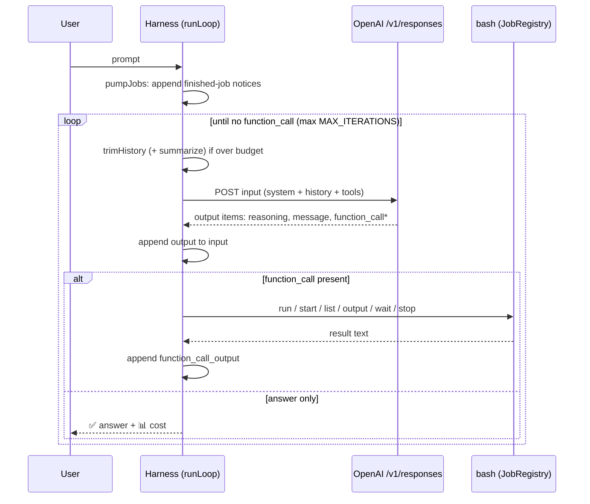

# agent

An experimental small (1k lines), [single-file](./agent.kt) coding agent written in Kotlin.

It has only one tool **bash**. No guardrails! Run it in a sandbox. OpenAI API only.

## Features

- Bash tool with foreground and background jobs.
- Interactive and batch mode.
- Sub-agents: calls itself recursively.
- Supports `CLAUDE.md` / `AGENTS.md`.
- History trimming.
- Cost estimation.

## Run

Requires [JBang](https://www.jbang.dev/)

```sh
export OPENAI_API_KEY=...
./agent.kt                          # interactive

echo "fix the tests" | ./agent.kt   # one-shot: answer on stdout
```

## How it works

### The agent loop




# Demo

```
echo "briefly explain agent.kt" | ./agent.kt
📄  Instructions: CLAUDE.md
🧠  **Planning concise file overview**
💻  Bash: grep -n "^\(fun \|class \|object \|data class \|enum class \|private fun \|const val \)" agent.kt | sed -n '1,220p'
📥  Output:
   [55 lines hidden]
   1049:fun JsonObject.str(key: String) = this[key]?.jsonPrimitive?.contentOrNull
   1050:fun JsonObject?.long(key: String) = this?.get(key)?.jsonPrimitive?.longOrNull ?: 0L
   1051:fun JsonObject?.obj(key: String) = this?.get(key) as? JsonObject
   1054:object Spinner {
   [Exit Code: 0 after 0s]

🧠  **Planning inspection around harness**
💻  Bash: sed -n '1,230p' agent.kt && echo '---' && sed -n '189,420p' agent.kt | sed -n '1,240p' && echo '---' && sed -n '515,640p' agent.kt
📥  Output:
   [226 lines hidden]
               prompted = true
           }
           when (val event = events.take()) {
               Event.EndOfInput -> break
   [Exit Code: 0 after 0s]

🧠  **Narrowing code extraction scope**
💻  Bash: sed -n '230,430p' agent.kt && echo '---' && sed -n '430,560p' agent.kt && echo '---' && sed -n '640,820p' agent.kt && echo '---' && sed -n '820,1100p' agent.kt
📥  Output:
   [251 lines hidden]
           worker?.apply { interrupt(); join() }
           worker = null
       }
   }
   [Exit Code: 0 after 0s]

🧠  **Summarizing agent architecture**
📊  24,026 in (6,144 cached, 25% hit) / 876 out (247 reasoning) · $0.0446 · session $0.0446
`agent.kt` is the **entire CLI harness** for this project (by design: one file, runnable with `./agent.kt`).

Briefly, it does 5 main things:

1. **Builds the agent prompt**
   - Defines the system prompt (how to use bash tool, background jobs, etc.).
   - Loads `CLAUDE.md` / `AGENTS.md` from the workspace and appends them once at startup.

2. **Runs the model loop**
   - Sends conversation history to OpenAI `/v1/responses`.
   - Reads `output` items (assistant text, reasoning, function calls).
   - Echoes response items back into history so tool-call chains continue correctly.
   - Stops when the model returns a final message (no more tool calls).

3. **Implements the `bash` tool**
   - Supports `run`, `start`, `list`, `output`, `wait`, `stop`.
   - Foreground commands have timeout/truncation behavior.
   - Background jobs are tracked and can trigger follow-up turns when they finish.

4. **Provides console UX + one-shot mode**
   - Interactive mode uses JLine (`./gradlew run` path).
   - Non-TTY stdin becomes one-shot mode (`echo "..." | ./agent.kt`).
   - Includes Ctrl+C handling, spinner/progress, plan-mode toggle, and session cost display.

5. **Infra utilities**
   - API retries/cancellation handling.
   - History trimming + summarization when input grows too large.
   - JSONL logging of requests/responses/tool events (`AGENT_LOG`).
   - Token/cost accounting and helper functions.

If you want, I can also give you a quick “map” of which function names to read first for onboarding.
```

